# Document Tracking System - Complete Flowchart Diagram

## System Overview Flowchart

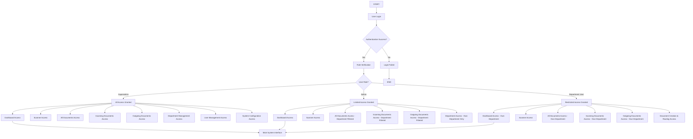

## Document Creation & Routing Flow (Department User Focus)

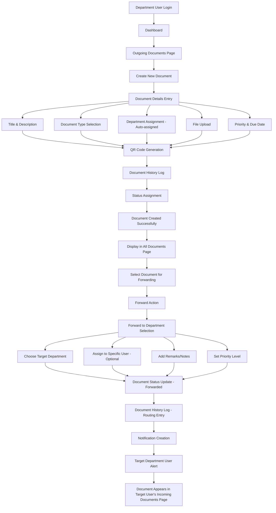

## Document Flow Between Departments

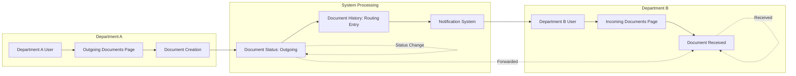

## Role-Based Navigation Flow

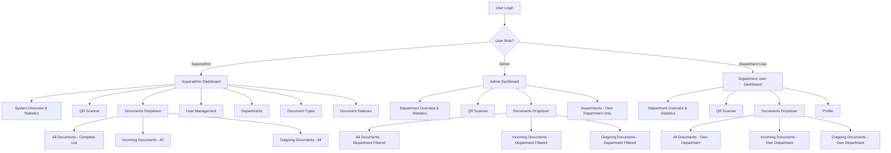

## Document Status Tracking Flow

```mermaid
flowchart LR
    A[Document Created] --> B[Draft Status]
    B --> C[Ready Status]
    C --> D[Forwarded Status]
    D --> E[Received Status]
    E --> F[Processing Status]
    F --> G[Under Review Status]
    G --> H[Approved Status]
    H --> I[Completed Status]
    I --> J[Archived Status]
    
    %% Status change triggers
    B -.->|User Action| C
    C -.->|Forward Action| D
    D -.->|Department Receives| E
    E -.->|User Processes| F
    F -.->|Review Required| G
    G -.->|Approval Decision| H
    H -.->|Work Complete| I
    I -.->|System Action| J
```

## Notification & Alert System Flow

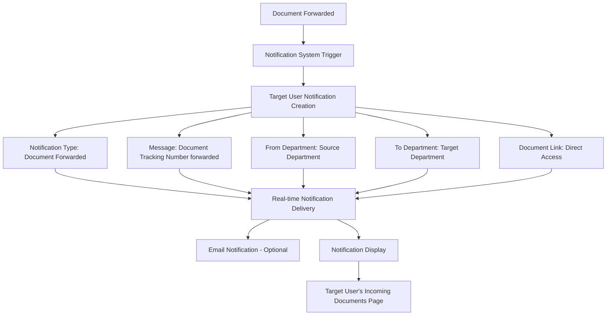

## QR Code Integration Flow

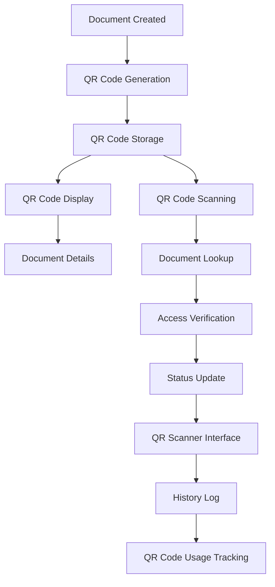

## Security & Access Control Flow

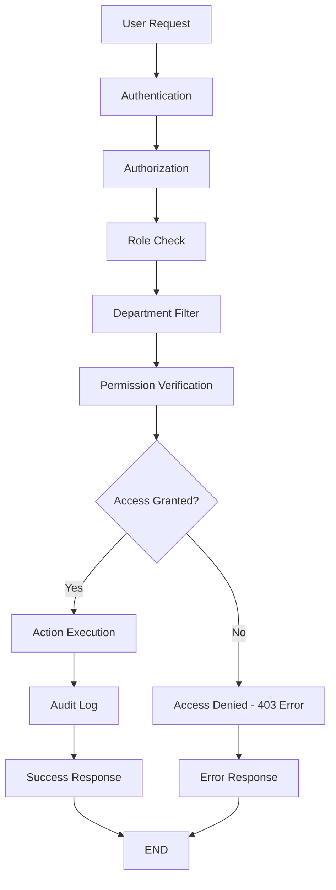

## Document Lifecycle Management Flow

```mermaid
flowchart TD
    subgraph "Incoming Documents Processing"
        A1[Document Received] --> A2[Incoming Documents Page]
        A2 --> A3[User Action]
        A3 --> A4[Document Review]
        A4 --> A5[Status Update]
        A5 --> A6[Document Processing]
        A6 --> A7[Internal Routing]
        A7 --> A8[Document Approval]
        A8 --> A9[Status Change]
        A9 --> A10[Document Completion]
        A10 --> A11[Archive/Forward]
    end
    
    subgraph "Outgoing Documents Management"
        B1[Document Creation] --> B2[Outgoing Documents Page]
        B2 --> B3[Document Management]
        B3 --> B4[Document Draft]
        B4 --> B5[Save for Later]
        B5 --> B6[Document Ready]
        B6 --> B7[Forward to Department]
        B7 --> B8[Document Sent]
        B8 --> B9[Status Update]
        B9 --> B10[Document Tracking]
        B10 --> B11[History Log]
    end
```

## Error Handling & Recovery Flow

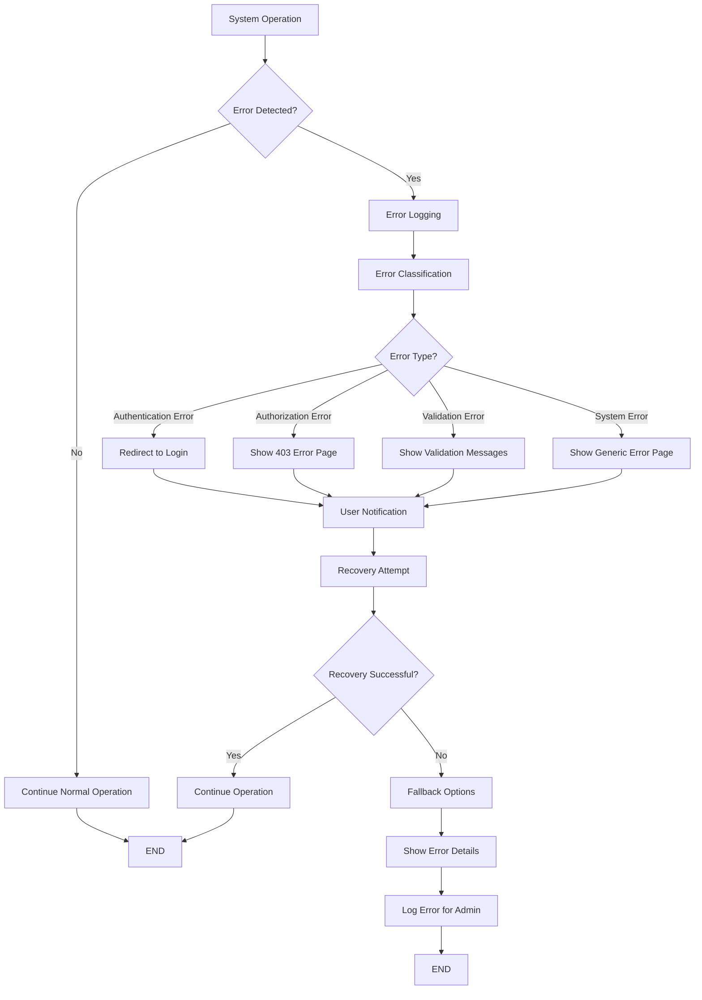

## Complete System Integration Flow

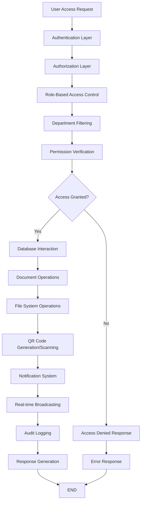

## Color Coding Legend

- **Purple**: Superadmin operations and access
- **Blue**: Admin operations and access  
- **Green**: Department User operations and access
- **Orange**: System processes and notifications
- **Red**: Error handling and security
- **Gray**: Database and file operations

## Key System Features Highlighted

1. **Role-Based Access Control (RBAC)** with Department Filtering
2. **Document Lifecycle Management** with Incoming/Outgoing Flow
3. **QR Code Integration** for Document Tracking
4. **Real-time Notifications** for Document Forwarding
5. **Audit Trail & History** with Routing Information
6. **Export & Reporting** with Role-Based Filtering
7. **Mobile-Responsive Design** for QR Scanner
8. **Multi-department Support** with Inter-department Routing
9. **File Upload & Management** with Department Restrictions
10. **Advanced Search & Filtering** by Department and Status

This comprehensive flowchart diagram provides a complete visual representation of the Document Tracking System, showing all the key flows, role-based access control, document creation and forwarding processes, and system integrations as specified in the updated FLOWCHART_PROMPT.md. 